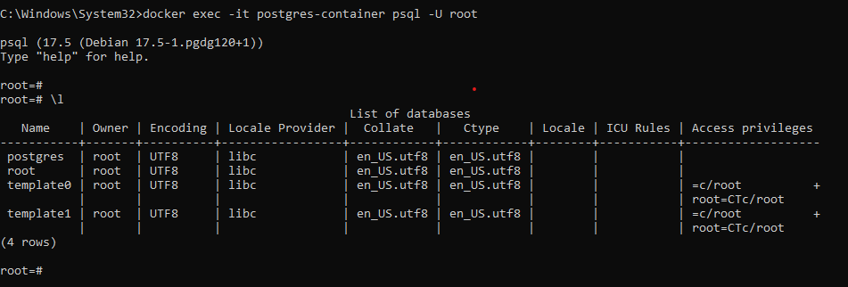

# How to Deploy Postgres with Docker

In this session I will teach you how to deploy [PostgreSQL](https://www.postgresql.org/) with [Docker](https://docs.docker.com/get-started/docker-overview/). Postgres is a free, open source and advanced database management system that supports both SQL(relational) and JSON(non-relational) querying.

## Deploying PostgreSQL with Docker

### Step 1: Search the Image

Begin by searching the Postgres image from the Docker Registry with the following command at the terminal.

```bash
docker search postgres
```

Having done the above now we can go ahead and and pull the latest PostgreSQL image with the following command:

```bash
docker pull postgres:latest
```

You can verify the downloaded image witht the following command:

```bash
docker images
```

### Step 2: Run the PostgreSQL Container

To run the conatiner execute the following command:

```bash
docker run --name postgres-container -e POSTGRES_USER=root -e POSTGRES_PASSWORD=secret -p 5432:5432 -d postgres
```

Explanation of the command:

1. Docker `run` this tells Docker to start (run) a new container based on the image.

1. `--name postgres-container` gives your container a custom name which is: `postgres-container`.

1. `e POSTGRES_USER=root` : This sets the **PostgresSQL username** to `root`. The `e` flag lets you define environment varibles.

1. `e POSTGRES_PASSWORD=secret`: This sets the password for the user to `secret`. Required for PostgreSQL to start.

1. `-p 5432:5432`: This is exposing the PostgreSQL port so your local machine can access it.

> - The first `5432` is the host port(local machine)
> - The second `5432` is the container port(inside the Docker container).
> - If you are using multiple databases you could change the first one, like `-p 5555:5432`.

1. `-d`: Means in detached mode - it runs in the background. You don't see logs unless you run `docker logs`.

1. `postgres`: This is the image name you are using.

#### What Hapens After You Run It

- Docker downloads the Postgres image if not already downloaded.
- It creates and starts a container named `postgres-container`.
- It runs Postgres inside the container with the user/password you've set.
- It exposes Postgres on port 5432, so tools like pgAdmin or your apps can connect using `localhost:5432`.

## Accesing PostgreSQL Command Line Inside Docker Container

Run the command:

```bash
docker exec -it postgres-container psql -U root
```

### Explanation

1. `docker exec`: This tells Docker - "Execuse a command inside a running container.

1. `-it`: Two flags combined:

   - `i` = interactive mode (keeps STDIN open)
   - `t` = allocates a TTY(terminal) so you can interact with it like a shell

1. `postgres-container`: This is the name of the running container where PostgreSQL is installed and running.

1. `psql`: This is the PostgreSQL **interactive terminal** (client tool)- it lets you run SQL commands and manage the database manually.

1. `-u root`: This tells `psql` to coonect as the user `root`.

You'll see a prompt like this:



To exit from the psql when done simply run:

```bash
\q
```

> This will return you to your regular shell. (outside the container)

## Instance

Assuming you database file is like:

`my_postgres.sql`:

1. Run the Postgres Container:

```bash
docker start postgres-container
```

> If not running yet follow step 2 for `Deploying PostgreSQL with Docker`

1. Copy Your SQL File Into the Container:

```bash
docker cp my_postgres_db.sql postgres-container:/my_postgres.sql
```

1. Run the SQL Script Inside the Container

```bash
docker exec -it postgres-container psql -U root -d mydatabase -f /my_postgres.sql
```
